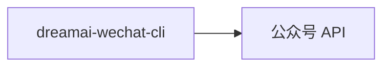
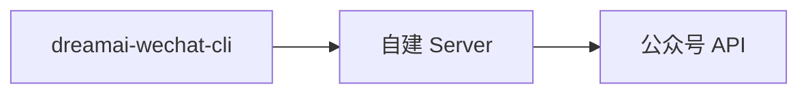

<div align="center">
    
</div>

# dreamai-wechat-cli

[](LICENSE)
[](https://github.com/iamtornado/dreamai-wechat-cli)

## 本仓库是什么

**[dreamai-wechat-cli](https://github.com/iamtornado/dreamai-wechat-cli)** 是基于上游 **[caol64/wenyan-cli](https://github.com/caol64/wenyan-cli)**（[文颜](https://wenyan.yuzhi.tech) 的命令行工具）的 **独立维护分支**，且 **仅包含 CLI**（命令行 + 可选 `serve` HTTP 服务）：不提供 macOS / Windows 桌面应用或 MCP 安装包，那些由文颜其它仓库维护，见官网说明。

- 本仓库以独立包名 **`@tornadoami/dreamai-wechat-cli`** 发布到 npm（并持续提供 GitHub 安装方式）。
- 依赖中的 **`@wenyan-md/core` 仍从 npm registry 拉取**（上游核心库），与「本 fork 是否单独发包」不是一回事。
- Issue、PR、迭代节奏与上游仓库分离；若使用上游已发布的 **`@wenyan-md/cli`**（全局命令为 `wenyan`），行为与版本以 npm 上游为准。

## 能做什么

在**微信公众号**场景下，本 CLI 可将 Markdown 排版后写入草稿箱，并封装更多**草稿箱相关 API**（与[微信公众平台草稿管理](https://developers.weixin.qq.com/doc/subscription/api/draftbox/draftmanage/api_draft_add.html)字段一致）。文颜生态还覆盖知乎、头条等能力，多由 **`@wenyan-md/core`** 演进；**本仓库交付物只有这条 CLI 线**，以公众号排版与发布为主。

## 特性

- 一键发布 Markdown 到微信公众号草稿箱
- 自动上传本地图片与封面
- **草稿箱原始 API**：`draft` 子命令与 `serve` 下的 HTTP 接口（`add` / `update` / `batchget` / `count` / `delete` / `get`）
- 支持远程 Server 发布（绕过 IP 白名单限制）
- 内置多套排版主题，支持自定义主题
- 适合 CI/CD、脚本或与 Agent 配合使用

## 快速开始

### 安装（npm）

```bash
npm install -g @tornadoami/dreamai-wechat-cli
```

安装后命令名为：

```bash
dreamai-wechat-cli --help
```

### 安装（GitHub）

需 **Node.js 18+**，并能访问 GitHub 与 npm registry（用于安装依赖）。克隆后执行 `prepare` 时会运行 `tsc` 生成 `dist/`。

```bash
npm install -g github:iamtornado/dreamai-wechat-cli
```

可将 `github:…` 改为指定分支或 tag，例如 `github:iamtornado/dreamai-wechat-cli#main`。

全局安装后的命令名为 **`dreamai-wechat-cli`**（与上游 npm 包 **`@wenyan-md/cli`** 提供的全局命令 **`wenyan`** 不同）。

### 常用命令

```bash
dreamai-wechat-cli publish -f article.md
dreamai-wechat-cli draft --help
```

从本仓库**克隆开发**时：请先 `npm install`；`prepare` / `npm run build` 会生成 `dist/`。

## 命令概览

```bash
dreamai-wechat-cli <command> [options]
```

| 命令      | 说明        |
| ------- | --------- |
| [publish](docs/publish.md) | 发布文章      |
| [mass](docs/mass.md) | 高级群发：`mass sendall`（默认全员图文 `mpnews`） |
| draft   | 草稿箱 API：`count` / `list` / `get` / `update` / `delete` / `add` / [`merge-add`](docs/draft-merge.md)（`dreamai-wechat-cli draft --help`） |
| render  | 渲染 HTML   |
| [theme](docs/theme.md)   | 管理主题      |
| [serve](docs/server.md)   | 启动 Server（含 `/draft/*` 与 `/publish` 等） |

## 概念

### 内容输入

内容输入是指如何把 Markdown 文章交给本 CLI，支持以下方式：

| 方式      | 示例        | 说明        |
| ------- | --------- |--------- |
| 本地路径（推荐） | `dreamai-wechat-cli publish -f article.md`      | 直接读取磁盘上的文章      |
| URL | `dreamai-wechat-cli publish -f http://test.md`      | 读取网络上的文章      |
| 参数 | `dreamai-wechat-cli publish "# 文章"`      | 适用于短内容     |
| 管道 | `cat article.md \| dreamai-wechat-cli publish`      | 适用于 CI/CD、脚本批量发布      |

### 环境变量配置

> [!IMPORTANT]
>
> 发布到微信需配置下列环境变量，否则接口会失败。

-   `WECHAT_APP_ID`
-   `WECHAT_APP_SECRET`

### 微信公众号 IP 白名单

> [!IMPORTANT]
>
> 请确保运行环境的 IP 已加入公众号后台 IP 白名单，否则接口会失败。

说明文档：[https://yuzhi.tech/docs/wenyan/upload](https://yuzhi.tech/docs/wenyan/upload)

### 文章格式

每篇 Markdown 顶部需要包含 `frontmatter`：

```md
---
title: 在本地跑一个大语言模型(2) - 给模型提供外部知识库
cover: /Users/xxx/image.jpg
author: xxx
source_url: http://
---
```

-   `title`（必填）、`cover`、`author`、`source_url` 等说明见上游习惯；**[示例文章](tests/publish.md)**

### 文内图片和文章封面

发布前会将正文图片按微信要求上传至素材库，支持本地绝对路径、网络 URL；在「本地文件」作为输入时，也支持相对文章路径（如 `./assets/image.png`）。

## Server 模式

本地模式：`dreamai-wechat-cli` 直接调公众号 API。远程模式：CLI 将请求发到自建的 Wenyan 兼容 Server，由服务端调微信 API。详见 **[docs/server.md](docs/server.md)**。





```bash
dreamai-wechat-cli publish -f article.md --server https://api.example.com --api-key your-api-key
```

## 赞助

以下为**文颜上游**项目的赞助入口；若你愿意支持原作者：

[https://yuzhi.tech/sponsor](https://yuzhi.tech/sponsor)

## License

Apache License Version 2.0
